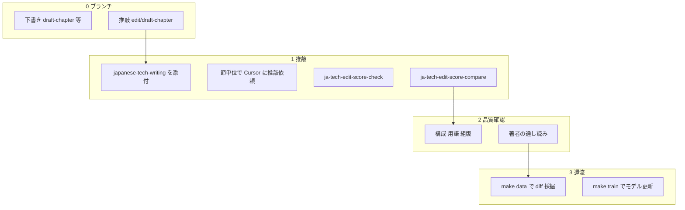
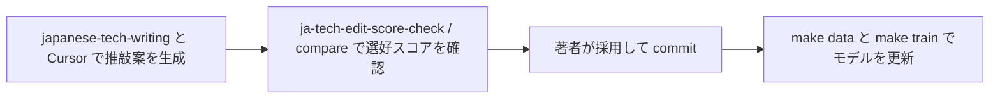

# 章推敲ワークフロー

日本語技術書（Markdown 原稿）の章を推敲するとき、**選好評価モデル**（ja-tech-edit-score）をどこで使うかをまとめる。
推敲文の生成そのものは行わない。
[README.md](../README.md) の概要とあわせて読む。

## 選好評価モデルの役割

| 行うこと | 行わないこと |
|----------|--------------|
| Git ブランチ間 diff から選好学習データを採掘 | 推敲文の自動生成 |
| 選好評価モデル（pref-static）の学習と更新 | 問題箇所の機械的一括検出 |
| 2つの推敲候補のどちらが選好に近いかを判定 | 生成モデルの fine-tune |

作業の流れ:



選好評価モデル単体の位置づけ:



## 推敲に使う Git ブランチ

1 章は通常 1 つの Markdown ファイル（例: `src/chapter.md`）に対応する。

| ブランチ | 例 | 内容 |
|----------|-----|------|
| 下書き | `draft-chapter`, `main` | 原稿 |
| 推敲 | `edit/draft-chapter` | 採用済みの編集の積み上げ |

学習データの採掘では **`ORG` に下書き**、**`EDT` に推敲** を指定する。

```bash
make data \
  DIR=/path/to/book-repo \
  ORG=draft-chapter \
  EDT=edit/draft-chapter \
  PATH=src/chapter.md
```

`main` が下書きでない章もある。
章ごとに下書きブランチ名を確認してから `ORG` を決める。

## 作業の流れ

### 1. 節単位で推敲案を生成する

対象は `###` または `####` 1 節ずつとする。
章全文を一度に渡さない。

- **`japanese-tech-writing` Skill** を添付する
- Pandoc や LaTeX の記法を維持する旨を毎回明示する:
  - `{#sec:...}`, `{#fig:...}`, `[^...]`, `[@...]`, `@sec:` 参照

依頼文の例:

> 以下は技術書原稿の一節です。
> japanese-tech-writing 規範に従い推敲してください。
> - 一文一行、段落は空行区切り
> - 中黒による並列、ダッシュは使わない
> - 図表、脚注、sec ラベルは維持
> - 意味を変えず、論証の順序と簡潔さを改善
>
> ```markdown
> （該当節）
> ```

### 2. 選好スコアを確認する

推敲ブランチ上で、作業ツリー（未コミットを含む）と下書きブランチの diff を hunk 単位で採点する。

```bash
cd /path/to/book-repo
ja-tech-edit-score-check src/chapter.md --format markdown
```

- 内部では `git diff <base> -- file` を使う（下書きブランチと現在のファイル内容を比較）
- 下書きブランチは `edit/foo` から `foo` を自動推定する（`--base` で上書き可）
- 出力形式: `markdown`（Cursor 向け）、`text`（ターミナル）、`json`
- Cursor では Skill **`ja-tech-edit-score-check`** を呼び出す（`make install-skills` で有効化）

初回セットアップ（学習済みモデルはリポジトリ同梱。`make train` は不要）:

```bash
cd ~/dev/ja-tech-edit-score
make venv && make install-bin && make install-skills
```

2回目以降のチェックは、モデル常駐デーモンによりおおよそ 0.1 秒で完了する（初回のみデーモン起動で約 9 秒）。
手動起動は `make daemon`、停止は `make daemon-stop`。

### 3. 迷う段落だけ 2 候補を比較する

同一段落について推敲案 A と B があり、どちらを採るか決められないときに使う。

```bash
ja-tech-edit-score-compare \
  --source-file /tmp/source_para.txt \
  --candidate-a-file /tmp/cand_a.txt \
  --candidate-b-file /tmp/cand_b.txt
```

リポジトリ内からは `make compare SOURCE=... CANDIDATE_A=... CANDIDATE_B=...` でもよい。

- 出力に `winner: A` または `B` とスコアが含まれる
- スコア差が小さい（例: 0.55 対 0.45）ときは著者が最終判断する
- 採用した案を推敲ブランチに commit する

### 4. 原稿を最終確認する

次を確認する:

1. **構成**：節の論理順、前方参照の位置、1 段落 1 トピック（Skill のチェックリストを Cursor に渡す）
2. **用語**：前章と本章内の一貫性（必要なら前章末尾をコンテキストに追加）
3. **組版**：リポジトリの手順で PDF をビルドし、図表と参照が生きているか確認
4. **通し読み**：著者が最終判断する

### 5. 章がまとまったら学習データへ還流する

```bash
cd ~/dev/ja-tech-edit-score

make data DIR=... ORG=... EDT=... PATH=src/chapter.md
# 複数章、複数リポジトリは繰り返す。または:
cp data/batch_import_repos.example.txt data/batch_import_repos.txt
# data/batch_import_repos.txt にリポジトリパスを1行ずつ書く
bash scripts/batch_import_repos.sh

make train   # 複数章分を蓄積してから実行してよい
```

## コマンド一覧

```bash
# 推敲リポジトリ上（推奨）
ja-tech-edit-score-check src/chapter.md --format markdown
ja-tech-edit-score-compare --source-file ... --candidate-a-file ... --candidate-b-file ...

# ja-tech-edit-score リポジトリ内
cd ~/dev/ja-tech-edit-score
make venv && make install-bin && make install-skills
make data DIR=<repo> ORG=<base> EDT=<edit-branch> [PATH=...]
make train
make check FILE=/path/to/file.md [BASE=...] [FORMAT=markdown]
make compare SOURCE=... CANDIDATE_A=... CANDIDATE_B=...
make daemon
make daemon-stop
```

環境変数: `JA_TECH_EDIT_SCORE_HOME`, `JA_TECH_EDIT_SCORE_MODEL`, `JA_TECH_EDIT_SCORE_BASE`, `JA_TECH_EDIT_SCORE_NO_DAEMON`

## 具体例（1 章）

```bash
cd /path/to/book-repo
git checkout edit/draft-chapter

# 推敲中: Cursor + japanese-tech-writing で src/chapter.md を節単位に編集

# 章の一区切りがついたら
cd ~/dev/ja-tech-edit-score
make data \
  DIR=/path/to/book-repo \
  ORG=draft-chapter \
  EDT=edit/draft-chapter \
  PATH=src/chapter.md
make train
```

## ツールごとの分担

| 段階 | ツール |
|------|--------|
| 規範 | `japanese-tech-writing` Skill |
| 推敲案の生成 | Cursor 等 |
| 選好スコア | ja-tech-edit-score（`ja-tech-edit-score-check`, `ja-tech-edit-score-compare`, Skill: `skills/ja-tech-edit-score-check`） |
| Best-of-N / 収束 | `ja-tech-edit-score-rank`, `ja-tech-edit-score-converge` |
| 最終確認 | 著者 + PDF |
